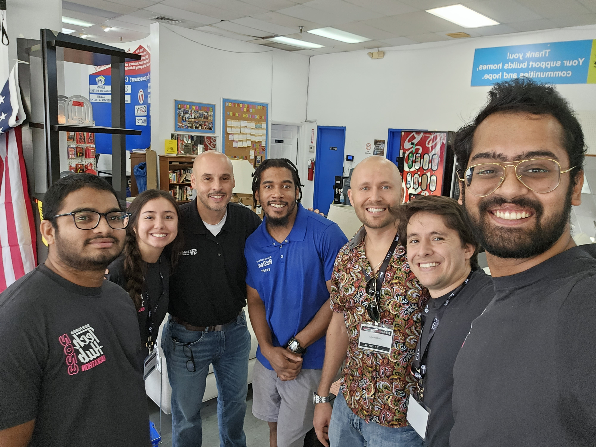
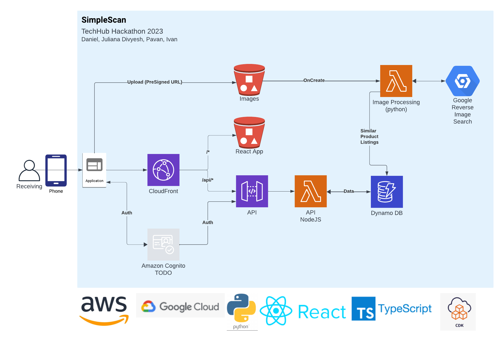

# Habitat for Humanity ReStore

**Challenge Title**: Streamlining Donations and Expanding Outreach

**Description**: Habitat for Humanity, a renowned non-profit organization dedicated to building homes and better communities, faces several operational challenges that your hackathon team can help address:

- Targeting New Audiences
  - Real-Time Inventory Management: Implement a solution that updates the online inventory in real-time, ensuring that customers are aware of available items and reducing discrepancies.

## Background

Before starting any design work, our team decided to take a field trip to the Broward Restore, which was 30 minutes away.

The store manager Mark, was very gracious and spent 30 minutes talking about the store, the mission, the volunteers, and the amazing items that pass through his store.

### Some interesting points

- Each store operates like a franchise and typically manages their own outreach, website, etc.
- Mark just came back from a conference with other Restores where they shared ideas and approaches.
- Some stores (Los Angeles) have an excellent social media presence including viral videos on TikTok.
- Independent stores can have their own website, but there is not a central platform for posting or managing inventory.
- The Broward store does not have a website, but they have a facebook page.
  - They move a lot of furniture, and the entire sales floor is typically replaced in a couple of weeks. Because each item is unique, maintaining a website inventory is a lot of overhead.

## Donation Receiving

Mark said that 54% of donations are corporate. Typically the item is scratched, dented, or discontinued.

He typically uses Google Lens to scan the item to get a feel for what the item sells for. From this price, he discounts about 50%.

## Proposal

- A SaaS like platform that is owned and managed by the Habitat for Humanity "Corporate"
- Each store is a "tenant" on the platform and can manage their own inventory.
- The inventory is streamlined using a web app, on a mobile phone
  - Receiving takes a photo and adds a 3 star quality rating.
  - App uploads photo to the cloud and uses an image recognition to identify the product.
  - If product is IDed, meta-data and trending price is returned to the app.
    - Price is automatically discounted based on stars: 3-50%, 2-60%, 1-70%
  - If the item is not IDed, the app prompts for metadata and price.
  - Idea: If current user is not the manager, the item will need to be approved by the manager.
    - Once approved, the item automatically shows up on the website and in the Point of Sale system.
  - A QR Code sticker is printed and attached to the item. (Bluetooth printer)
  - When the item is sold, the sticker scanned, and it is automatically removed from the website.
- The SaaS platform dynamically builds a storefront for each tenant
  - Adds the ability to search all stores in the vicinity.
  - Customers can buy online and pick up in the store.
    - Orders not picked up within X days are a donation.

## What's Next

We started from the customer, and determined that the problem isnt the lack of an online store. The problem is the tediousness of data entry. By injecting our app into the process Mark is already doing, we can use his work to build and maintain a database.

Now that we have a database, it's pretty easy to display it online or relist it to other platforms like FaceBook Marketplace, OfferUp, etc. Images are added and removed automatically

This also creates an opportunity to capture contact information for an entirely new list of customers without any additional steps. Each time someones buys online, and picks up in the store, their contact info is captured.

## Architecture

With 900 stores across the country and hundreds of thousands of customers, we need to consider scalability. We chose to build using managed services in the cloud for resilience, durability, and scalability.

